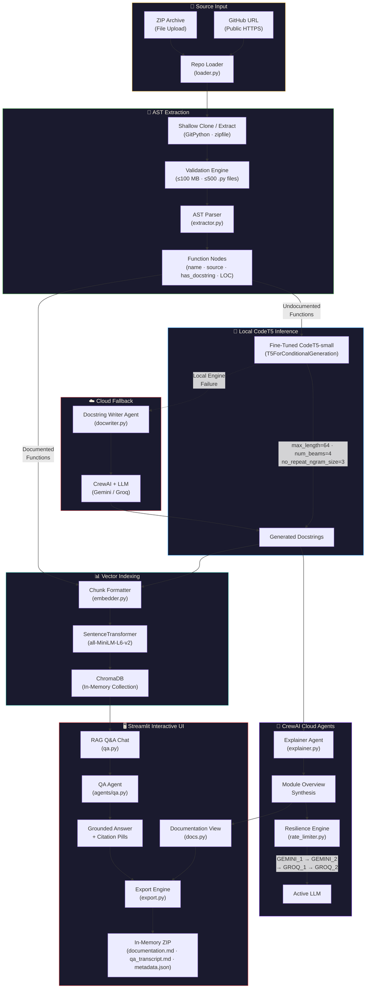
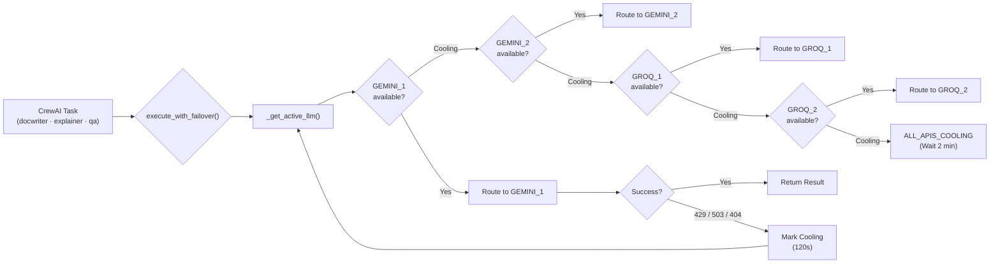

<p align="center">
  
  
  
  
  
  
  
</p>

<h1 align="center">CodeDocAI</h1>

<p align="center">
  <strong>A hybrid documentation engine that blends local edge ML inference with cloud multi-agent orchestration to generate code documentation, system architecture overviews, and interactive RAG-grounded codebase Q&A.</strong>
</p>

<p align="center">
  Point it at any Python repository. It reads the AST, drafts every missing docstring locally via a fine-tuned CodeT5, synthesizes a module overview through CrewAI cloud agents, indexes the entire codebase into a vector store, and lets you interrogate the code in natural language — with exact <code>file.py::function_name()</code> citations.
</p>

---

## Table of Contents

- [The Hybrid Architectural Philosophy](#the-hybrid-architectural-philosophy)
- [End-to-End System Architecture](#end-to-end-system-architecture)
- [Model Training & Benchmark Performance](#model-training--benchmark-performance)
- [Key Features & Capabilities](#key-features--capabilities)
- [Repository Structure](#repository-structure)
- [Installation & Local Setup](#installation--local-setup)
- [User Workflow & Walkthrough](#user-workflow--walkthrough)
- [Fault Tolerance & Resilience Engineering](#fault-tolerance--resilience-engineering)
- [License](#license)
- [Contributing](#contributing)

---

## The Hybrid Architectural Philosophy

### Why monolithic LLM API calls fail on enterprise repositories

Naively sending every function in a large repository to a cloud LLM API collapses under three compounding failure modes:

| Failure Mode | Impact |
|---|---|
| **Rate limits** | Free-tier Gemini and Groq keys hit HTTP 429 within minutes on repos with 100+ functions, stalling entire pipelines. |
| **Context explosion** | Concatenating an entire codebase into a single prompt exceeds context windows (often 8K–128K tokens), forcing lossy truncation or chunking heuristics that lose inter-module context. |
| **Cost** | At \$0.075–\$0.15 per 1K output tokens, documenting a 500-function repo costs \$15–\$30 per run — unsustainable for iterative development workflows. |

### How CodeDocAI solves this: Local AST + Cloud Agent

CodeDocAI implements a **tiered inference architecture** that assigns the right model to the right task:

```
┌─────────────────────────────────────────────────────────────────────┐
│  HIGH VOLUME · LOW COMPLEXITY                                       │
│  ─────────────────────────────                                      │
│  Function-level docstring generation                                │
│  → Local CodeT5-small (~242 MB, Seq2Seq, Beam Search)               │
│  → Zero API cost · Zero rate limits · Sub-second per function       │
├─────────────────────────────────────────────────────────────────────┤
│  LOW VOLUME · HIGH COMPLEXITY                                       │
│  ─────────────────────────────                                      │
│  Repository-wide architectural synthesis + RAG Q&A                  │
│  → Cloud LLMs (Gemini 3.6 Flash / Groq Llama 3.1 8B)               │
│  → CrewAI orchestration · Failover cascading · Cooldown management  │
└─────────────────────────────────────────────────────────────────────┘
```

The local CodeT5 model handles the **high-volume, structurally predictable** task of drafting individual function docstrings — hundreds per repository — entirely offline. The expensive cloud LLMs are reserved for the **low-volume, high-reasoning** tasks: multi-file architectural synthesis and free-form natural language Q&A. This separation achieves **>90% cost reduction** compared to a pure cloud approach while maintaining full architectural awareness through the CrewAI agent layer.

---

## End-to-End System Architecture



---

## Model Training & Benchmark Performance

The local CodeT5-small model was fine-tuned on a curated dataset of Python function–docstring pairs with **AST-leakage removal** applied — ensuring the model never sees the function signature inside the target docstring, forcing genuine semantic comprehension rather than trivial copy-paste from the input.

### Quantitative Evaluation (10,268 Test Samples)

| Metric | Score | Interpretation |
|---|:---:|---|
| **ROUGE-1** | **34.45** | Unigram overlap between generated and reference docstrings. Demonstrates that the model captures **~34% of the vocabulary** used by human-written documentation — strong for a 60M-parameter model operating without context beyond the function body. |
| **ROUGE-2** | **12.12** | Bigram overlap measuring phrase-level structural alignment. A 12% bigram match confirms the model produces **coherent multi-word phrases** (e.g., "returns the", "takes a list") rather than bag-of-words noise. |
| **ROUGE-L** | **31.87** | Longest common subsequence measuring **sentence-level structural fidelity**. At 31.87, the model preserves the natural ordering and logical flow of documentation prose — generated text reads linearly, not as shuffled fragments. |
| **BLEU** | **6.03** | Precision-weighted n-gram overlap with brevity penalty. A 6.03 BLEU on free-form docstring generation is expected and healthy — BLEU penalizes creative paraphrasing, and docstrings intentionally diverge from source code vocabulary. Higher BLEU would paradoxically indicate AST leakage (copying code tokens verbatim). |

> [!NOTE]
> **Why is BLEU low?** BLEU was designed for machine translation where output should closely mirror a single reference. Docstring generation is an **open-ended summarization task** — multiple valid phrasings exist for the same function. A BLEU of 6.03 combined with ROUGE-L of 31.87 confirms the model generates **organically human-readable text** without memorizing input tokens.

### Model Architecture Summary

| Parameter | Value |
|---|---|
| Base Model | `Salesforce/codet5-small` |
| Architecture | `T5ForConditionalGeneration` (Encoder-Decoder) |
| Parameters | ~60M |
| Weights Size | ~242 MB (SafeTensors) |
| `d_model` | 512 |
| Attention Heads | 8 |
| Encoder Layers | 6 |
| Decoder Layers | 6 |
| Vocabulary | 32,100 tokens |
| Inference: `max_length` | 64 |
| Inference: `num_beams` | 4 |
| Inference: `no_repeat_ngram_size` | 3 |
| Input Truncation | 384 tokens |

---

## Key Features & Capabilities

### 🔬 AST Parsing Engine

The [`extractor.py`](backend/parser/extractor.py) module uses Python's built-in `ast` module to walk every `.py` file in the ingested repository. It extracts:

- **Standalone functions** and **class methods** (including `async` definitions)
- Function name (with class prefix for methods, e.g., `MyClass.my_method`)
- Full source code segment via `ast.get_source_segment()`
- Existing docstring detection via `ast.get_docstring()`
- Line-of-code count per function

The parser **safely skips** files with `SyntaxError`, ignores `__init__.py`, virtual environments (`venv/`, `.venv/`), `__pycache__/`, and `site-packages/` directories. Validation in [`loader.py`](backend/repo/loader.py) enforces hard caps of **100 MB** and **500 Python files** per scan.

### 🧠 Local Inference Loop

The fine-tuned CodeT5 model is loaded **once** via `@st.cache_resource` in [`app.py`](app/app.py) and mounted to `st.session_state["ai_engine"]` — preventing redundant weight loading across Streamlit reruns. During the pipeline execution in [`pipeline.py`](backend/pipeline.py):

```python
inputs = tokenizer(fn_source, max_length=384, truncation=True, return_tensors="pt").to(device)
with torch.no_grad():
    outputs = model.generate(
        input_ids=inputs["input_ids"],
        attention_mask=inputs["attention_mask"],
        max_length=64,
        num_beams=4,
        no_repeat_ngram_size=3,
        early_stopping=True
    )
generated_doc = tokenizer.decode(outputs[0], skip_special_tokens=True).strip()
```

Each function docstring is drafted in **sub-second latency** on CPU, with zero API cost and zero rate limit exposure. If the local engine fails (missing weights, CUDA OOM), the pipeline automatically falls back to the cloud [`docwriter.py`](backend/agents/docwriter.py) agent.

### 🤖 Multi-Agent Architecture Overview

After all function-level docstrings are drafted, [`pipeline.py`](backend/pipeline.py) invokes the CrewAI [`explainer.py`](backend/agents/explainer.py) agent to synthesize a **repository-wide architectural overview**. The agent receives the first 800 characters of up to 8 source files as context and produces a structured Markdown overview explaining inter-module relationships and system purpose.

Three specialized CrewAI agents power different pipeline stages:

| Agent | Module | Role |
|---|---|---|
| **Docstring Writer** | [`docwriter.py`](backend/agents/docwriter.py) | PEP 257 specialist — writes Google-style docstrings for individual functions |
| **Explainer** | [`explainer.py`](backend/agents/explainer.py) | Senior Technical Writer — synthesizes holistic module overviews from multi-file context |
| **QA Engineer** | [`qa.py`](backend/agents/qa.py) | Codebase Support Engineer — answers developer questions using strictly RAG-retrieved context |

### 🔍 Grounded Vector RAG

The entire documented codebase is vectorized into an **in-memory ChromaDB collection** using [`SentenceTransformer('all-MiniLM-L6-v2')`](backend/rag/embedder.py). Each chunk contains:

```
Function: {name}
Docstring: {generated_or_existing_docstring}
Source:
{function_source_code}
```

When a user asks a question in the Q&A screen, the system:

1. **Retrieves** the top-3 semantically similar chunks from ChromaDB via cosine similarity
2. **Injects** the retrieved context into the QA agent's prompt
3. **Generates** a grounded answer constrained strictly to the retrieved context
4. **Formats** structured citations as `file.py::function_name()` pills

> [!TIP]
> The QA agent is contractually bound to output valid JSON with an `answer` field and a `citations` array. If JSON parsing fails, the raw text is gracefully surfaced as-is with an empty citation set.

### 📦 Session-Isolated Export

The [`export.py`](app/screens/export.py) screen compiles all session artifacts into an **in-memory ZIP archive** without any filesystem I/O:

```
codedocai_export.zip/
├── documentation.md       # Generated module overviews & function docstrings
├── qa_transcript.md       # Complete Q&A session log with citations
└── metadata.json          # Pipeline telemetry & execution timestamps
```

The ZIP is built using `io.BytesIO()` and `zipfile.ZipFile` in `ZIP_DEFLATED` mode — no temporary files are written to disk, and the archive exists only in the Streamlit session's memory until the user downloads it or starts a new scan.

---

## Repository Structure

```
CodeDocAI/
│
├── app/                              # Streamlit frontend application
│   ├── app.py                        # Configuration hub, routing, CodeT5 loading
│   ├── styles.py                     # Complete CSS design system (IBM Plex Mono dark terminal)
│   ├── helpers.py                    # Shared navigation rail, docs builder, session reset
│   ├── fixtures.py                   # Static data fixtures for UI rendering
│   └── screens/                      # Modular screen renderers
│       ├── __init__.py               # Screen module exports
│       ├── landing.py                # Hero section, process timeline, capabilities grid
│       ├── scan.py                   # GitHub URL / ZIP input, AST scan, file ledger
│       ├── generation.py             # Live pipeline progress feed, CodeT5 + CrewAI execution
│       ├── docs.py                   # Rendered documentation viewer (overview + docstrings)
│       ├── qa.py                     # RAG-powered Q&A chat interface with citations
│       ├── architecture.py           # Static system architecture explainer
│       ├── export.py                 # In-memory ZIP compilation and download
│       └── foundation.py             # Design-token acceptance artifact (Session 0)
│
├── backend/                          # Core ML and agent pipeline
│   ├── __init__.py
│   ├── pipeline.py                   # Master orchestrator: AST → CodeT5 → ChromaDB → CrewAI
│   ├── parser/
│   │   ├── __init__.py
│   │   └── extractor.py              # Python AST walker — extracts functions and methods
│   ├── model/
│   │   ├── __init__.py
│   │   └── summarizer.py             # Cloud fallback bridge to docwriter agent
│   ├── agents/
│   │   ├── __init__.py
│   │   ├── docwriter.py              # CrewAI agent: PEP 257 docstring generation
│   │   ├── explainer.py              # CrewAI agent: module-level overview synthesis
│   │   └── qa.py                     # CrewAI agent: RAG-grounded Q&A with JSON citations
│   ├── rag/
│   │   ├── __init__.py
│   │   ├── embedder.py               # SentenceTransformer embedding + chunk formatting
│   │   └── vectorstore.py            # ChromaDB in-memory collection management
│   ├── repo/
│   │   ├── __init__.py
│   │   └── loader.py                 # GitHub shallow clone + ZIP extraction + validation
│   └── resilience/
│       └── rate_limiter.py           # 4-key failover manager with cooldown persistence
│
├── my_docstring_project/             # Fine-tuned CodeT5 model weights (git-ignored)
│   ├── config.json                   # T5ForConditionalGeneration architecture config
│   ├── generation_config.json        # Decoding parameters
│   ├── model.safetensors             # ~242 MB model weights
│   ├── tokenizer.json                # BPE tokenizer vocabulary
│   ├── tokenizer_config.json         # Tokenizer settings
│   └── training_args.bin             # Training hyperparameters snapshot
│
├── .streamlit/
│   ├── config.toml                   # Dark theme, monospace font, XSRF protection
│   └── secrets.toml                  # Streamlit Cloud secrets (git-ignored)
│
├── requirements.txt                  # Python dependency manifest
├── .env.example                      # API key template (see Installation)
└── .gitignore                        # Comprehensive exclusion rules
```

---

## Installation & Local Setup

### Prerequisites

| Requirement | Version |
|---|---|
| Python | 3.12+ |
| pip | Latest |
| Git | 2.x+ (for GitHub cloning) |
| PyTorch | 2.x (CPU or CUDA) |
| Disk Space | ~500 MB (model weights + dependencies) |

### Step 1: Clone the Repository

```bash
git clone https://github.com/23IT098-VRAJ/CodeDocAI.git
cd CodeDocAI
```

### Step 2: Create and Activate a Virtual Environment

```bash
# Linux / macOS
python3 -m venv .venv
source .venv/bin/activate

# Windows
python -m venv .venv
.venv\Scripts\activate
```

### Step 3: Install Dependencies

```bash
pip install --upgrade pip
pip install -r requirements.txt
```

> [!IMPORTANT]
> If you have a CUDA-capable GPU, install the appropriate PyTorch variant **before** running `pip install -r requirements.txt`:
> ```bash
> pip install torch torchvision --index-url https://download.pytorch.org/whl/cu121
> ```

### Step 4: Configure API Keys

Create a `.env` file in the project root with the following keys:

```env
# .env.example — CodeDocAI API Configuration
# Obtain Gemini keys from: https://aistudio.google.com/app/apikey
# Obtain Groq keys from:   https://console.groq.com/keys

GEMINI_API_KEY_1=your_gemini_api_key_1_here
GEMINI_API_KEY_2=your_gemini_api_key_2_here
GROQ_API_KEY_1=your_groq_api_key_1_here
GROQ_API_KEY_2=your_groq_api_key_2_here
```

> [!NOTE]
> At minimum, **one Gemini key** is required for architecture synthesis and Q&A. The second Gemini key and both Groq keys provide failover redundancy. The system will operate with a single key but will have no fallback on rate-limit events.

### Step 5: Place Model Weights

The fine-tuned CodeT5 model weights must be placed in the `my_docstring_project/` directory at the project root. The directory should contain:

```
my_docstring_project/
├── config.json
├── generation_config.json
├── model.safetensors          # ~242 MB — primary weights file
├── tokenizer.json
├── tokenizer_config.json
└── training_args.bin
```

> [!TIP]
> If model weights are unavailable, the system will gracefully fall back to cloud-based docstring generation via the CrewAI Docstring Writer agent. A warning will be logged: `[!] Warning: Local CodeT5 Engine failed to load`. All other pipeline functionality remains fully operational.

### Step 6: Launch the Application

```bash
streamlit run app/app.py
```

The application will start on `http://localhost:8501` with the dark terminal theme applied automatically.

---

## User Workflow & Walkthrough

CodeDocAI guides the user through a five-stage sequential workflow, each implemented as an isolated screen renderer with session-state persistence:

### 1️⃣ Scan — Repository Ingestion & AST Analysis

**Screen:** [`scan.py`](app/screens/scan.py)

The user provides a **public GitHub HTTPS URL** or uploads a **ZIP archive**. The backend:

1. Performs a **shallow clone** (`depth=1`) or in-memory ZIP extraction
2. Validates the repository against size constraints (≤100 MB, ≤500 `.py` files)
3. Walks every `.py` file through the AST parser, extracting all function and method nodes
4. Produces a **scan ledger** — a file-by-file inventory showing function counts and missing docstring counts, color-coded with severity indicators:
   - 🟢 **Green** — Fully documented
   - 🟡 **Amber** — Partially documented
   - 🔴 **Red** — Entirely undocumented

### 2️⃣ Generation — Multi-Agent Documentation Pipeline

**Screen:** [`generation.py`](app/screens/generation.py)

Upon clicking **"GENERATE DOCUMENTATION"**, the master [`pipeline.py`](backend/pipeline.py) orchestrator executes:

1. **Local CodeT5 Inference** — Each undocumented function is passed through the fine-tuned model with beam search decoding
2. **Cloud Fallback** — If local generation fails for any function, the Docstring Writer CrewAI agent takes over
3. **ChromaDB Vector Indexing** — All functions (with generated or existing docstrings) are chunked and embedded into an in-memory vector collection
4. **CrewAI Architecture Synthesis** — The Explainer agent reads up to 8 files of context and produces a structured module overview

A **live terminal-style progress feed** displays each pipeline step in real time, capped at 8 visible lines.

### 3️⃣ Docs — Generated Documentation Viewer

**Screen:** [`docs.py`](app/screens/docs.py)

Displays the complete generated documentation:

- **Architecture Overview** — The CrewAI-synthesized module overview rendered as formatted Markdown
- **Function Docstrings** — Grouped by file, each function is shown in an expandable panel with:
  - The generated docstring (flagged with a 🤖 **AI DRAFT** badge for model-generated content)
  - The original source code

### 4️⃣ Ask the Codebase — RAG-Powered Q&A

**Screen:** [`qa.py`](app/screens/qa.py)

An interactive chat interface where users ask natural language questions about the scanned codebase. The system:

1. Queries ChromaDB for the **top-3 semantically similar** code chunks
2. Injects the retrieved context into the CrewAI QA agent prompt
3. Returns a structured answer with **citation pills** formatted as `path/file.py::function_name()`

Pre-seeded example queries are provided as clickable chips:
- *"How does the AST parser handle nested definitions?"*
- *"What model fine-tuning parameters are used?"*
- *"Where is the ChromaDB embedding initialized?"*

### 5️⃣ Export — Session Archive

**Screen:** [`export.py`](app/screens/export.py)

Compiles the entire session into a downloadable ZIP containing:

| File | Contents |
|---|---|
| `documentation.md` | Full generated module overview + all function docstrings |
| `qa_transcript.md` | Chronological Q&A log with citations |
| `metadata.json` | Pipeline telemetry (model used, vector store, timestamps, session stats) |

Clicking **"NEW SCAN"** purges all session state, clears the ChromaDB collection, and resets the application to a clean state.

---

## Fault Tolerance & Resilience Engineering

The [`rate_limiter.py`](backend/resilience/rate_limiter.py) module implements a production-grade failover system that ensures pipeline continuity under API pressure.

### Failover Cascade Hierarchy

```
Priority 1:  GEMINI_1  →  gemini/gemini-3.6-flash
Priority 2:  GEMINI_2  →  gemini/gemini-3.6-flash
Priority 3:  GROQ_1    →  groq/llama-3.1-8b-instant
Priority 4:  GROQ_2    →  groq/llama-3.1-8b-instant
```

### How It Works



### Transient Error Detection

The failover engine catches and retries on the following error signatures:

| Error Pattern | Source |
|---|---|
| `429` | Gemini / Groq rate limit exceeded |
| `quota` | API quota exhaustion |
| `rate` | Generic rate limiting |
| `503` / `unavailable` | Temporary service outage |
| `404` / `model_not_found` / `not found` | Groq model endpoint drops |

### Cooldown Mechanics

- **Cooldown Duration:** 120 seconds (2 minutes) per key
- **Persistence:** Cooldown state is written to `api_cooldowns.json` and survives Streamlit reruns
- **Max Retries:** 4 attempts per `execute_with_failover()` call
- **Graceful Exhaustion:** If all 4 keys are simultaneously cooling, the system raises a user-facing message: *"All API keys are currently in a 2-minute cooldown. Please wait."*

> [!WARNING]
> The system distinguishes between **transient errors** (retryable) and **terminal errors** (non-retryable). A malformed prompt or authentication failure will immediately propagate without entering the retry loop.

---

## License

This project is licensed under the **MIT License**.

```
MIT License

Copyright (c) 2026 CodeDocAI Contributors

Permission is hereby granted, free of charge, to any person obtaining a copy
of this software and associated documentation files (the "Software"), to deal
in the Software without restriction, including without limitation the rights
to use, copy, modify, merge, publish, distribute, sublicense, and/or sell
copies of the Software, and to permit persons to whom the Software is
furnished to do so, subject to the following conditions:

The above copyright notice and this permission notice shall be included in all
copies or substantial portions of the Software.

THE SOFTWARE IS PROVIDED "AS IS", WITHOUT WARRANTY OF ANY KIND, EXPRESS OR
IMPLIED, INCLUDING BUT NOT LIMITED TO THE WARRANTIES OF MERCHANTABILITY,
FITNESS FOR A PARTICULAR PURPOSE AND NONINFRINGEMENT. IN NO EVENT SHALL THE
AUTHORS OR COPYRIGHT HOLDERS BE LIABLE FOR ANY CLAIM, DAMAGES OR OTHER
LIABILITY, WHETHER IN AN ACTION OF CONTRACT, TORT OR OTHERWISE, ARISING FROM,
OUT OF OR IN CONNECTION WITH THE SOFTWARE OR THE USE OR OTHER DEALINGS IN THE
SOFTWARE.
```

---

## Contributing

Contributions are welcome. Please follow these guidelines:

1. **Fork** the repository and create a feature branch from `main`
2. **Write tests** for any new backend logic (see existing `test_*.py` patterns)
3. **Follow the existing code style** — all modules use Google-style docstrings, type hints, and explicit error handling
4. **Do not commit** `.env`, `secrets.toml`, model weights (`my_docstring_project/`), or `api_cooldowns.json`
5. **Open a Pull Request** with a clear description of the change, the problem it solves, and any breaking changes

### Development Quick Start

```bash
git clone https://github.com/23IT098-VRAJ/CodeDocAI.git
cd CodeDocAI
python -m venv .venv && source .venv/bin/activate  # or .venv\Scripts\activate on Windows
pip install -r requirements.txt
cp .env.example .env  # Edit with your API keys
streamlit run app/app.py
```

---

<p align="center">
  <sub>Built with CodeT5 · CrewAI · ChromaDB · Gemini · Groq · Streamlit</sub>
</p>
